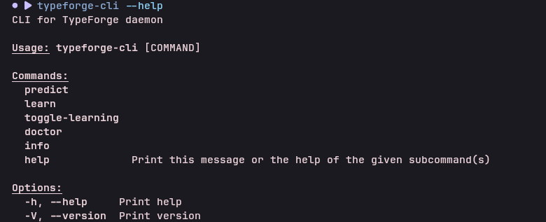
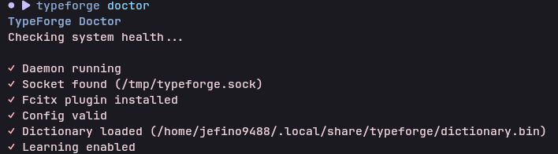
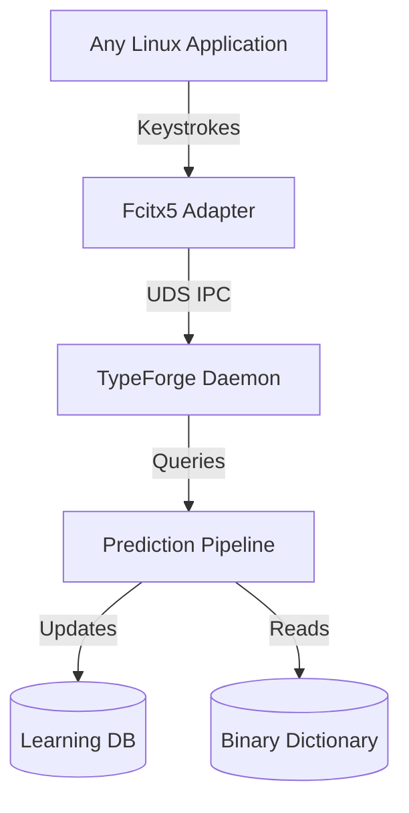

<div align="center">

# TypeForge 

[](LICENSE)
[](https://github.com/Jefino9488/TypeForge/actions)
[](https://github.com/Jefino9488/TypeForge/releases)

`The intelligent keyboard Linux never had.`

</div>

## Why TypeForge?

Linux still lacks a modern, system-wide predictive keyboard.

TypeForge brings fast, privacy-first autocomplete to every application through a native Fcitx5 integration. It learns how you write, adapts to different applications, and runs entirely offline—your keystrokes never leave your machine.

Whether you're writing emails, documentation, or chat messages, TypeForge helps you type less and write more.

### Why I built this

>Modern smartphones have predictive keyboards that learn how you write, but the Linux desktop still lacks an equivalent experience. Existing input methods focus primarily on multilingual input rather than intelligent typing assistance. TypeForge exists to bring fast, offline, privacy-first predictive typing to every Linux application while remaining fully open source.

### Compared to the default Fcitx5 experience

- No personal learning
- Weak prediction models
- No personalization
- No context awareness

## Features:

### ⚡ Fast Prediction

```text
fram
│
├─ FrameworkForge
├─ framework
└─ frame

space
↓

FrameworkForge
```

### 🖥 Context Aware
Your keyboard should know where it is typing.
- **Firefox:** `Best reg` ➔ `Best regards,`
- **Discord / Chat:** `Om` ➔ `On my way!`

### 🔒 Privacy First

- 100% offline
- No cloud services
- No telemetry
- Your typing never leaves your machine
## Comparison

| Feature            | TypeForge | Default Fcitx5 |
|--------------------|-----------|----------------|
| **Offline**        | ✅         | ✅              |
| **Learns locally** | ✅         | ❌              |
| **Open Source**    | ✅         | ✅              |
| **Context-aware**  | ✅         | ❌              |
| **AI Ready**       | ✅         | ❌              |


## 🚀 Quick Start

**Supports:**
- Wayland
- X11
- Fcitx5

Ensure you have Fcitx5 installed, then run:

```bash
# Download and extract the latest release
tar -xzf TypeForge-Linux-x86_64.tar.gz
cd typeforge

# Install TypeForge system-wide
chmod +x install.sh
sudo ./install.sh
```

Verify everything is working and configure your theme:

```bash
# Verify system health
typeforge doctor

# Set a bundled theme and layout
typeforge theme apply catppuccin-mocha-mauve
typeforge layout set horizontal
```


## 🛠️ Command Line Interface

TypeForge comes with a powerful built-in CLI to manage your predictive engine and customize your experience.



### Diagnostics & Health
Run `typeforge doctor` at any time to verify that the background daemon, socket, Fcitx5 plugin, and dictionary are all running perfectly.



### Available Commands
- **`predict <prefix>`** - Manually test the prediction engine right in the terminal.
- **`learn <word>`** - Force the local database to learn a specific custom word or phrase.
- **`toggle-learning`** - Instantly pause or resume the local learning engine.
- **`theme apply <name>`** - Apply bundled Catppuccin themes.
- **`layout set <horizontal|vertical>`** - Change the UI orientation of the prediction popup.


## Vision & Roadmap

TypeForge isn't just another autocomplete library. It's trying to become the default intelligent keyboard for the Linux desktop.

- **Today:** Word prediction
- **Next:** Phrase prediction
- **Then:** Sentence completion
- **Eventually:** Optional local AI-assisted predictions

### Current Progress

✅ Offline prediction

✅ Spell correction

✅ Personal learning

✅ Smart ranking

🚧 Phrase prediction

🚧 Tiny neural reranker

⬜ Windows

⬜ macOS


## Screenshots


- **Prediction popup:** Predicting "better" in a horizontal layout (Catppuccin theme).


## Architecture



## Benchmarks

Built in Rust for maximum performance. Because a keyboard shouldn't lag.

| Metric               | Measurement |
|----------------------|-------------|
| **Prediction Speed** | `~2.6 μs`   |
| **Daemon Binary**    | `< 5 MB`    |

*(Prediction latency verified via Criterion benchmarks on a 10,000-word dataset.)*


<div align="center">
  <b><a href="https://github.com/Jefino9488/TypeForge">⭐ Star the repository</a></b> |
  <b><a href="https://github.com/Jefino9488/TypeForge/issues">🐛 Report bugs</a></b> |
  <b><a href="https://github.com/Jefino9488/TypeForge/issues">💡 Suggest ideas</a></b> |
  <b><a href="CONTRIBUTING.md">🤝 Contribute</a></b>
  
  <br>
  <i>Every contribution helps make intelligent typing on Linux better.</i>

  Distributed under the <a href="LICENSE">Apache 2.0 License</a>.
</div>