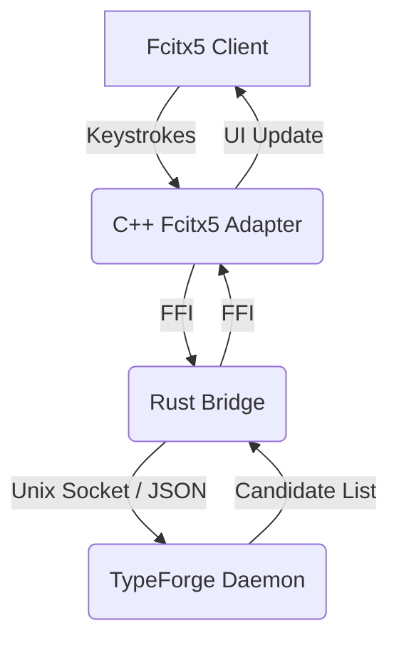

# TypeForge Architecture Overview

TypeForge is split into three main components:

1. **The Daemon (`typeforge-daemon`)**: A background service written in Rust that holds the dictionaries, manages the learning databases, and performs all predictions.
2. **The Adapter (`adapters/fcitx5`)**: The input method plugin that runs inside your desktop environment. It intercepts keystrokes and draws the UI.
3. **The IPC Protocol**: The Unix Domain Socket protocol that connects the adapter to the daemon.

## Why this design?
By keeping the heavy lifting inside the Daemon, we ensure that the Fcitx5 adapter remains incredibly lightweight. This prevents input lag, even when loading massive dictionaries or running complex AI models in the future.
